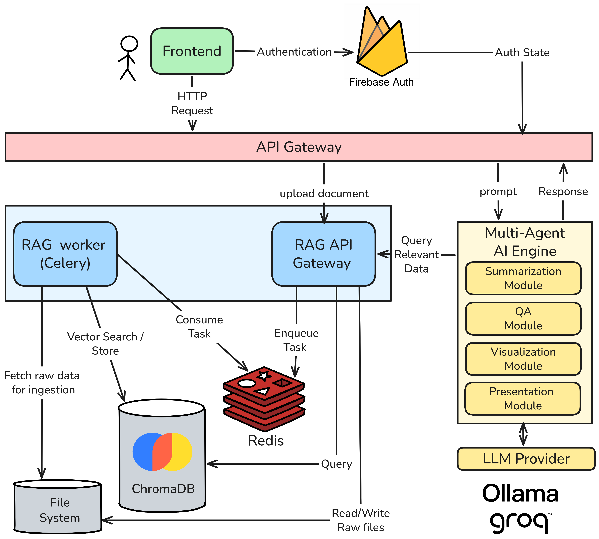

<div align="center">


# Smart-Doc

### Multimodal Document Intelligence — turn any document into summaries, diagrams, slides, and answers

Smart-Doc is a multi-agent, retrieval-augmented platform that reads your PDFs and documents — **text *and* images** — and lets you summarize them at any depth, generate visual diagrams, build presentation slides, and chat with the content in **English or Arabic**.

[🌐 **Live Demo**](http://40.81.243.229/) &nbsp;•&nbsp; [🎬 **Demo Video**](https://drive.google.com/file/d/1FaGiYbbEwkm1wcuerrbqoT-O8aeWJw7k/view?usp=sharing) &nbsp;•&nbsp; [▶️ **Watch Marketing Video**](https://youtu.be/aEpr-a9NB5A?si=uJuArfv6aeJmAIRi)

> ⚠️ **Heads up:** the live site is still under active development and may occasionally be unstable or offline.


</div>

---

## 📑 Table of Contents

- [Overview](#-overview)
- [Key Features](#-key-features)
- [Architecture](#-architecture)
- [Tech Stack](#-tech-stack)
- [Getting Started](#-getting-started)
  - [Run with Docker (recommended)](#run-with-docker-recommended)
  - [Run locally for development](#run-locally-for-development)
- [Configuration](#-configuration)
- [Project Structure](#-project-structure)
- [Our Contribution](#-our-contribution)
- [Future Work](#-future-work)
- [Related Work & Inspirations](#-related-work--inspirations)
- [Team](#-team)
- [License](#-license)

---

## 🔍 Overview

Most documents mix prose, tables, figures, and diagrams — and most tools only read the words. **Smart-Doc treats a document as multimodal from the start.** During ingestion it extracts and embeds both text and images, so every downstream feature (summaries, diagrams, slides, Q&A) can reason over what a page *shows*, not just what it *says*.

Under the hood, each capability is a small team of specialized AI agents coordinated as a **LangGraph state machine**, grounded by a dedicated **retrieval-augmented generation (RAG)** service. Documents are isolated per user, ingestion runs asynchronously in the background, and the whole system ships as a set of containers you can bring up with a single command.

---

## ✨ Key Features

### 🧠 Multimodal Summarization
Grounded summaries that draw on both the text and the figures in your document. Three depth modes let you dial in exactly how much detail you want:

| Mode | Purpose |
|------|---------|
| **Snapshot** | One-glance TL;DR |
| **Overview** | Balanced summary |
| **Deep Dive** | Thorough, section-level detail |

Text and image evidence are summarized in parallel by separate analyst agents, then merged by a synthesis agent using a token/compression budget.

### 📊 Automatic Diagram Generation
Describe what you want and Smart-Doc generates a **Mermaid.js** diagram grounded in the document. Supported types include flowcharts, sequence diagrams, state diagrams, class diagrams, entity-relationship (ER) diagrams, pie charts, and mind maps — with an iterative *generate → review → revise* agent loop for quality.

### 🖼️ Slide Generation
Turns a document into a downloadable **PowerPoint (`.pptx`)** deck through a pipeline of agents that summarize text, caption images, generate slide code, and review each page before rendering.

### 💬 Document Q&A
Ask questions and get context-aware answers grounded in the retrieved passages and figures. A multi-agent chain (text, image, general, and critical-review agents) collaborates on each answer, with per-conversation chat memory.

### 🌍 Multilingual (Arabic + English)
Language is auto-detected at ingestion and query time, and content is routed to language-specific embedding collections — English via `all-MiniLM-L6-v2`, Arabic via `GATE-AraBert-v1`.

### 👤 Per-User Document Isolation
Every request is scoped by a user ID, so each user only ever retrieves and reasons over their own uploaded documents.

---

## 🏗️ Architecture

Smart-Doc is split into three application services plus two infrastructure components, all orchestrated with Docker Compose over a shared data volume.

<div align="center">



</div>

**Request flow at a glance:**
1. The **frontend** authenticates users (Firebase) and sends chat/upload requests to the backend.
2. The **backend** picks the right LangGraph pipeline (summary / visualization / slides / QA) and calls the retrieval service for grounding context.
3. The **retrieval service** enqueues uploads to a **Celery worker** (via Redis) for async ingestion, and serves multimodal similarity search from **ChromaDB**.

---

## 🧰 Tech Stack

| Layer | Technologies |
|-------|-------------|
| **Frontend** | React 19, TypeScript, Vite, TailwindCSS, React Router, Firebase Auth, Mermaid.js, Framer Motion |
| **Backend (orchestration)** | Python 3.11, FastAPI, LangGraph, LangChain, Uvicorn, python-pptx |
| **LLM providers** | Groq, OpenAI-compatible endpoints, Ollama (configurable) |
| **Retrieval / RAG** | FastAPI, ChromaDB, sentence-transformers, OpenCLIP, BLIP captioning, PyMuPDF, Ultralytics (YOLO), langdetect |
| **Async & infra** | Celery, Redis, Docker, Docker Compose |

---

## 🚀 Getting Started

### Run with Docker

The whole stack — frontend, backend, retrieval API, ingestion worker, Redis, and ChromaDB — comes up together.

**Prerequisites:** [Docker](https://www.docker.com/) and Docker Compose.

```bash
# 1. Clone the repository
git clone https://github.com/GP-SmartDoc/Smart-Doc.git
cd Smart-Doc

# 2. Create your environment file (see Configuration below)
cp .env.example .env
#   then open .env and add your API keys

# 3. download models so they can be mounted into the container.
python retrieval_service/download_models.py

# 4. Build and start everything
docker compose up --build
```

Once it's running:

| Service | URL |
|---------|-----|
| Frontend | http://localhost:3000 |
| Backend API | http://localhost:8000 |
| Retrieval API | http://localhost:8001 |
| ChromaDB | http://localhost:8002 |

---

## ⚙️ Configuration

Copy `.env.example` to `.env` and fill in your keys. Smart-Doc supports multiple LLM backends — set `MODEL_BACKEND` to the one you want.

| Variable | Description |
|----------|-------------|
| `MODEL_BACKEND` | Which provider to use: `groq`, `openai`, or `ollama` |
| `MODEL_TEMPERATURE` | Sampling temperature for generation |
| `GROQ_API_KEY` | API key when using Groq |
| `TEXT_MODEL` / `IMAGE_MODEL` | Model names for text / image reasoning (Groq) |
| `OPENAI_API_KEY` / `OPENAI_API_BASE` / `OPENAI_MODEL` | OpenAI-compatible endpoint settings |
| `OLLAMA_MODEL` | Model name when using a local Ollama server |
| `VISUALIZATION_MODEL` | Model used for diagram generation |

> Keep your real `.env` out of version control — only `.env.example` should be committed.

---

## 📁 Project Structure

```
Smart-Doc/
├── frontend/                     # React + Vite + TypeScript client
│   └── src/
│       ├── components/           # LandingPage, ChatApp
│       └── lib/                  # Firebase + auth context
│
├── backend/                      # FastAPI orchestration + LangGraph agents
│   └── src/smart_doc/
│       ├── app/                  # FastAPI app, routes, schemas, settings
│       ├── core/                 # chat memory, models, RAG proxy
│       ├── features/             # one LangGraph pipeline per capability
│       │   ├── summarization/
│       │   ├── visualization/
│       │   ├── slide_generation/
│       │   └── question_answering/
│       └── utils/                # PDF, image, pptx, string helpers
│
├── retrieval_service/            # FastAPI RAG engine
│   └── src/retrieval_service/
│       ├── engine/               # ingestion + query + multimodal RAG engine
│       ├── main.py               # retrieval API
│       └── worker.py             # Celery ingestion worker
│
├── assets/                       # logo, architecture diagram, etc.
├── docker-compose.yml            # local/dev orchestration
├── docker-compose.prod.yml       # production orchestration
└── .env.example                  # environment template
```

---

## 🌟 Our Contribution

<!-- TODO: tailor this to what your team wants to emphasize for the examiners -->

Smart-Doc brings together ideas from recent multi-agent and multimodal-RAG research into a single, working, end-to-end system. Our main contributions are:

- **Unified AI platform.** Four document-intelligence modules — summarization, diagram generation, slide generation, and Q&A — brought together in one place instead of scattered across separate tools, all sharing the same multimodal retrieval backbone.
- **Privacy & localization.** Smart-Doc can run fully on your own machine. With a local LLM backend (Ollama) and locally downloaded embedding and captioning models, no document ever has to leave your infrastructure — ideal when data privacy matters.
- **Adaptive visual integration.** Diagram generation isn't a standalone feature; it's woven into the other modules. When an output is complex and needs more explanation, Smart-Doc automatically brings in a visual to make it clearer.
- **A production-minded, containerized architecture** — separate orchestration and retrieval services, asynchronous ingestion via Celery/Redis, per-user data isolation, and a one-command Docker Compose deployment.

---

## 🔭 Future Work

<!-- TODO: adjust to match your team's actual roadmap -->

- **Meeting/Video Integration** — Upload meeting recordings or lectures and automatically generate summaries, slides, and Q&A.
- **Interactive Slide Editing** — Enable real-time presentation editing with native PowerPoint and Google Slides export.
- **Richer slide themes** — additional templates and layout options for generated decks.
- **Voice-Driven Synthesis** — Support collaborative sessions with voice interaction through speech-to-text and text-to-speech.


---

## 📚 Related Work & Inspirations

Smart-Doc draws on ideas from recent research in multi-agent document understanding and LLM-driven generation, including MDocAgent (multi-agent document understanding), PreGenie (automated slide creation), and Metal-style multi-agent systems, alongside modern Mermaid-based diagram-generation approaches.

---

## 👥 Team

This project was developed as a graduation project by:

- Youssef Ahmed Mostafa
- Youssef Mohammed Ahmed
- Youssef Mohsen Reda
- Waleed Ahmed Ashour
- Anas Wael Mohammed
- Mohammed Ahmed Abdelsattar

Supervised by: **Dr. Donia Gamal**

Ain Shams University
Faculty of Computer & Information Sciences
Computer Science Department

---
